# Command Line Interface (CLI)
Sub-Materi
1. [Basic Command](#1-basic-command)
2. [Administrative Command](#2-administrative-command)
3. [Export Variable](#3-export-variable)
4. [Menginstall Software](#4-menginstall-software)

## 1. Basic Command
##### 1. pwd
*print working directory*. Untuk mengetahui di directory mana kita berada sekarang.
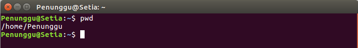

##### 2. ls
*list*. Untuk menampilkan file-file apa saja yang ada di suatu directory.
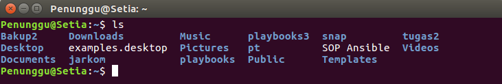
Parameter yang sering dipakai pada perintah ls adalah `-a` dan `-l`.
- Saat menggunakan parameter `-a` maka semua file akan ditampikan, termasuk yang *hidden* (diawali dengan `.`).
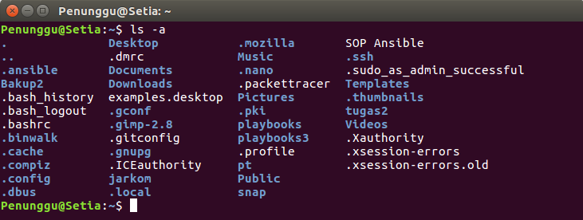
- Sedangkan parameter `-l` menampilkan file yang tidak *hidden* dalam format *long-list*.
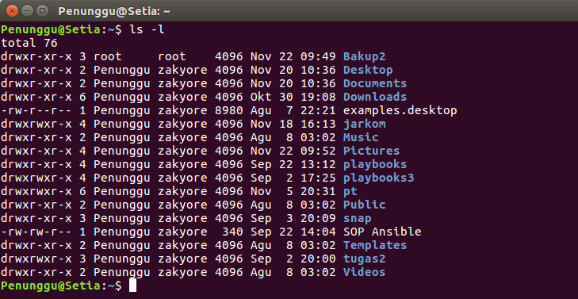

##### 3. cd
*change directory*. Digunakan untuk pindah ke directory lain. Syntax-nya adalah `cd [namadirectory]`. 
Misalnya kita sedang berada di directory `/home/Penunggu` dan ingin berpindah ke directory `Desktop/`. Maka command yang kita gunakan adalah `cd Desktop/`

Contoh lain:
+ `cd` untuk pindah ke directory home user
+ `cd /` untuk pindah ke directory root
+ `cd ..` untuk pindah ke parent directory dari directory sekarang
+ `cd -` untuk pindah ke working directory sebelumnya 
 
##### 4. mkdir
*make directory*. Digunakan untuk membuat sebuah directory (folder).
Syntax-nya adalah `mkdir [namadirectory]`
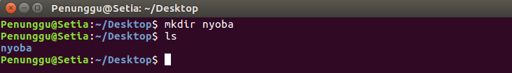

##### 5. cp
*copy*. Digunakan untuk menyalin (meng-copy) file.
Syntax-nya adalah `cp [namafile] [namacopyannya]`
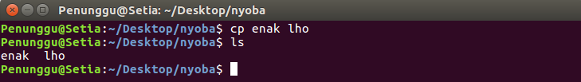

##### 6. mv
*Move* Digunakan untuk memindahkan suatu file ke directory lain.
+ Untuk memindahkan file, syntax-nya adalah `mv [namafile] [pathbarunya]`
+ Selain itu `mv` dapat juga digunakan untuk me-rename file, syntax-nya adalah `mv [namafile] [namabaru]`
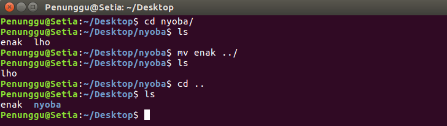

##### 7. cat
*concatenate*. Digunakan untuk menampilkan isi dari suatu file.
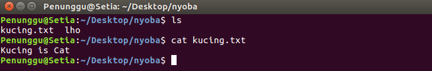

##### 8. rm
*remove*. Digunakan untuk menghapus suatu file.
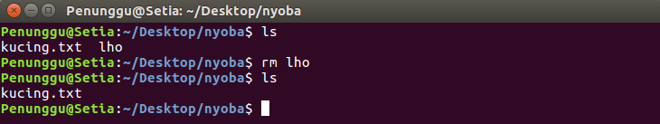
Selain itu rm juga dapat digunakan untuk menghapus directory, yaitu dengan menambahkan parameter `-r`
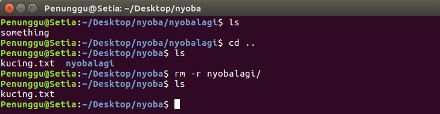

##### 9. rmdir
*remove directory*. Digunakan untuk menghapus directory yang kosong.
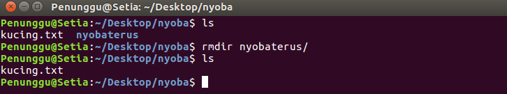

##### 10. echo
##### 11. grep
##### 12. tar
##### 13. zip
Command ini digunakan untuk melakukan compress data menjadi bentuk zip. Syntax-nya adalah `zip [namafilezip] [file1] [file2]`.
Misalnya kita ingin mengompress file **makanan** dan **cemilan** menjadi  **energi.zip** .
Maka command yang kita jalankan adalah `zip energi makanan cemilan`

##### 14. unzip
Kebalikan dari command zip, unzip digunakan untuk mengekstrak isi dari file .zip
Syntax-nya adalah `unzip [namafilezip]`.
Jadi untuk mengekstrak file foobar.zip kita perlu menjalankan comman `unzip energi.zip`.

##### 15. exit
Digunakan untuk menutup terminal atau mengakhiri suatu script (misalnya saat melakukan ssh ke komputer lain)

##### 16. clear
Digunakan untuk 'membersihkan' isi layar terminal.
Sebelum clear:
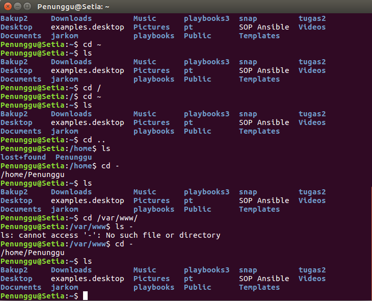
Sesudah clear:
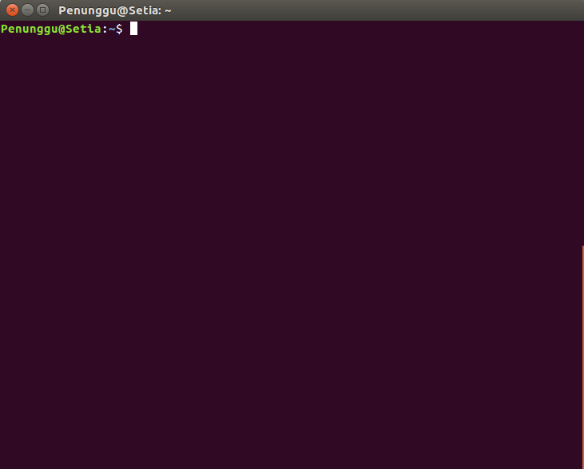

##### 17. mount
##### 18. tree

## 2. Administrative Command

##### 24. vim
vim merupakan singkatan dari "Vi IMprovised" dan merupakan salah satu teks editor pada OS Linux yang dapat digunakan untuk mengedit jenis teks apapun, termasuk suatu program komputer. Vim diupgrade dari teks editor vi, yang memiliki beberapa peningkatan dari vi, beberapa diantaranya adalah syntax highlighting, on-line help, multi-windows dan buffers, dll.
Untuk lebih jelas perbedaan antara vim dan vi : https://github.com/vim/vim/blob/master/runtime/doc/vi_diff.txt
###### 1. Install vim teks editor
```sh
$ sudo apt-get update
```
```sh
$ sudo apt-get install -y vim
```
instalasi akan berjalan, dan setelah vim terinstall akan terlihat output seperti ini:

## 3. Export Variable
## 4. Menginstall Software

##### 1. apt-get update
```sh
$ sudo apt-get update
```
command **apt-get** dengan opsi **_update_** akan menyinkronisasi ulang file indeks paket dari sumber mereka. indeks-indeks dari paket yang tersedia akan diambil dari lokasi-lokasi yang telah ditentukan di _etc/apt/sources.list_.
##### 2. apt-get install pkg
```sh
$ sudo apt-get install <packages>
```
Opsi **install** ini diikuti oleh beberapa nama paket yang akan diinstall. 
Semua paket yang dibuthkan oleh paket yang akan diinstall juga akan terunduh dan terinstall. Berkas /etc/apt/sources.list digunakan untuk menentukan lokasi repositori dari paket yang dimaksud.
