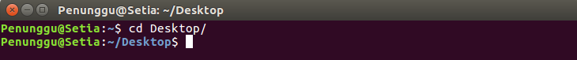

# Command Line Interface (CLI)
Sub-Materi
1. [Basic Command](#1-basic-command)
2. [Administrative Command](#2-administrative-command)
3. [File Editing](#3-file-editing)
4. [Export Variable](#4-export-variable)
5. [Menginstall Software](#5-menginstall-software)

### 1. Basic Command
##### 1. pwd
*print working directory*. Untuk mengetahui di directory mana kita berada sekarang.


##### 2. ls
*list*. Untuk menampilkan file-file apa saja yang ada di suatu directory.
  
Parameter yang sering dipakai pada perintah ls adalah `-a` dan `-l`.
- Saat menggunakan parameter `-a` maka semua file akan ditampikan, termasuk yang *hidden* (diawali dengan `.`).

- Sedangkan parameter `-l` menampilkan file yang tidak *hidden* dalam format *long-list*.


##### 3. cd
*change directory*. Digunakan untuk pindah ke directory lain. Syntax-nya adalah `cd [namadirectory]`. 
Misalnya kita sedang berada di directory `/home/Penunggu` dan ingin berpindah ke directory `Desktop/`. Maka command yang kita gunakan adalah `cd Desktop/`
  
Contoh lain:
+ `cd` untuk pindah ke directory home user
+ `cd /` untuk pindah ke directory root
+ `cd ..` untuk pindah ke parent directory dari directory sekarang
+ `cd -` untuk pindah ke working directory sebelumnya 
 
##### 4. mkdir
*make directory*. Digunakan untuk membuat sebuah directory (folder).
Syntax-nya adalah `mkdir [namadirectory]`


##### 5. cp
*copy*. Digunakan untuk menyalin (meng-copy) file.
Syntax-nya adalah `cp [namafile] [namacopyannya]`


##### 6. mv
*Move* Digunakan untuk memindahkan suatu file ke directory lain.
+ Untuk memindahkan file, syntax-nya adalah `mv [namafile] [pathbarunya]`

+ Selain itu `mv` dapat juga digunakan untuk me-rename file, syntax-nya adalah `mv [namafile] [namabaru]`


##### 7. cat
*concatenate*. Digunakan untuk menampilkan isi dari suatu file.


##### 8. rm
*remove*. Digunakan untuk menghapus suatu file.
  
Selain itu rm juga dapat digunakan untuk menghapus directory, yaitu dengan menambahkan parameter `-r`


##### 9. rmdir
*remove directory*. Digunakan untuk menghapus directory yang kosong.


##### 10. echo
Digunakan untuk menampilkan string yang kita inputkan.
Syntax-nya `echo [string yang diinginkan]`


##### 11. grep
Digunakan untuk menampilkan setiap baris pada suatu file yang mengandung kata yang dicari.
Syntax-nya adalah `grep "[katayangdicari]" [namafile]`


##### 12. zip
Command ini digunakan untuk melakukan compress data menjadi bentuk zip. Syntax-nya adalah `zip [namafilezip] [file1] [file2]`.
Misalnya kita ingin mengompress file **makanan** dan **cemilan** menjadi  **energi.zip** .
Maka command yang kita jalankan adalah `zip energi makanan cemilan`


##### 13. unzip
Kebalikan dari command zip, unzip digunakan untuk mengekstrak isi dari file .zip
Syntax-nya adalah `unzip [namafilezip]`.
Jadi untuk mengekstrak file foobar.zip kita perlu menjalankan comman `unzip energi.zip`.


##### 14. exit
Digunakan untuk menutup terminal atau mengakhiri suatu script (misalnya saat melakukan ssh ke komputer lain)

##### 15. clear
Digunakan untuk 'membersihkan' isi layar terminal.
Sebelum clear:  
  
Sesudah clear:  


##### 16. mount


##### 17. tree
Digunakan untuk menampilkan list directory.
[tree](img/tree.png)

### 2. Administrative Command
###### 1. su
Digunakan untuk mengganti user ID atau menjadi superuser.
Syntax-nya adalah `su`

###### 2. sudo
Digunakan untuk menjalankan command sebagai superuser.
Syntax-nya adalah `sudo [command]`

###### 3. chown
Digunakan untuk mengubah kepemilikan dari suatu file.
Syntax-nya adalah `chown [namauser] [namafile]`

###### 4. passwd
Digunakan untuk meng-*update* password user.

###### 5. chmod
Digunakan untuk mengubah izin akses dari suatu dokumen.


### 3.  File Editing
##### 24. vim
vim merupakan singkatan dari "Vi IMprovised" dan merupakan salah satu teks editor pada OS Linux yang dapat digunakan untuk mengedit jenis teks apapun, termasuk suatu program komputer. Vim diupgrade dari teks editor vi, yang memiliki beberapa peningkatan dari vi, beberapa diantaranya adalah syntax highlighting, on-line help, multi-windows dan buffers, dll.
Untuk lebih jelas perbedaan antara vim dan vi : https://github.com/vim/vim/blob/master/runtime/doc/vi_diff.txt
##### Install vim teks editor
```sh
$ sudo apt-get update
```
```sh
$ sudo apt-get install -y vim
```
##### Membuat dan menginsert teks 
Syntax yang biasa digunakan adalah `vim [nama-file]`. Setelah command tersebut dijalankan akan terlihat lambang `~` pada tiap baris yang kosong. 
```sh
$ vim nyoba.txt
```


Vim sekarang dalam *mode normal*. Untuk menginsertkan teks, maka ketik `i` untuk masuk ke *mode insert* dan diikuti dengan mengetikkan teks yang diinginkan.
Ketika kita menekan `i` untuk menginsertkan teks, karakter yang kita inputkan akan terketik sesuai dengan posisi kursor saat itu. Agar karakter yang kita inputkan terketik pada sebelah kanan posisi kursor, maka kembalikan vim pada mode normal, dan tekan `a`. Maka karakter yang kita inputkan akan terketik pada sebelah kanan posisi kursor saat itu.

Jika sudah selesai menginputkan teks, tekan `esc` dan vim akan kembali ke mode normal. Dalam mode normal, tekan `h` untuk bergerak ke kiri, `l` untuk ke kanan, `j` untuk bergerak ke atas dan `k` untuk ke bawah.


##### Menghapus karakter
Untuk menghapus sebuah karakter, selain bisa dilakukan pada mode insert dapat pula dilakukan ketika vim dalam *mode normal*. Yaitu dengan mengarahkan tanda kursor pada karakter yang ingin dihapus, dan menekan `x`.
Contohnya misal ketika kursor diletakkan pada huruf pertama yaitu huruf *i* pada kalimat *ini baris 3 ya* dan `x` ditekan sebanyak 4 kali, maka kalimat pada baris tersebut yang tersisa adalah *baris 3 ya*.


##### Menghapus baris
Jika yang ingin dihapus adalah satu baris penuh, maka yang perlu dilakukan pada *mode normal* yaitu memposisikan kursor pada baris yang ingin dihapus, dan ketikkan `dd`. Misalnya kita ingin menghapus baris pertama dimana terdapat kalimat *hehe :)* maka setelah memposisikan kursor pada baris tersebut, ketika kita mengetikkan `dd` maka baris yang tersisa adalah *nyoba nulis* sebagai baris pertama dan *baris 3 ya* sebagai baris ke-2.


##### Menggabungkan dua baris
Untuk menggabungkan dua baris menjadi satu baris atau dengan kata lain menghilangkan spasi diantara 2 baris, maka pada *mode normal* cukup dengan memposisikan kursor pada kalimat di baris pertama dan tekan `J`. Maka kalimat pada baris kedua akan menjadi satu baris dengan kalimat pertama.


##### Undo dan Redo
Pada teks editor vim, untuk meng-undo perubahan yang barusan kita lakukan dilakukan dengan mengetik `u`. Maka pengerjaan yang baru saja kita lakukan akan ter-undo.
Sedangkan untuk me-redo atau kebalikan dari undo yang baru saja kita lakukan yaitu dengan menekan `Ctrl+R`.

##### Menulis pada line baru
Pertama posisikan kursor pada sebuah baris. Untuk membuat line baru dibawah baris tersebut, tekan `o` dan otomatis sebuah baris baru akan terbentuk di bawah kalimat tersebut dengan vim sudah berada pada mode insert. Jika baris yang ingin ditambahkan berada diatas baris tempat kursor berada saat ini, maka dilakukan dengan menekan `O`. 

##### Keluar dari teks editor vim
1. Keluar tanpa menyimpan perubahan apa-apa dengan mengetikkan `:q!`
2. Keluar dan menyimpan perubahan dilakukan pada mode normal dengan mengetikkan `ZZ`

Untuk mengeksplorasi lebih lanjut mengenai teks editor vim, terdapat tutorial vim yang bisa diakses melalui terminal
```sh
$ vimtutor
```

##### 25. gedit
Gedit atau *Gnome-Text-Editor* adalah teks editor untuk GNOME desktop dan dapat digunakan untuk mengedit teks jenis apapun.
Syntax yang biasa digunakan untuk menjalankan tek editor ini adalah 
```sh
$ gedit [nama-file]
```

Misal kita akan membuat file txt dengan nama *cobagedit* maka ketikkan pada terminal
```sh
$ gedit cobagedit.txt
```
Halaman gedit pun akan muncul dan kita bisa menginputkan teks yang kita inginkan.


File gedit memungkinkan kita untuk mengedit banyak file sekaligus. Syntax yang digunakan 
```sh
$ gedit cobagedit.txt nyobajuga.txt
```


##### 26. nano
Nano atau *Nano's ANOther editor* merupakan teks editor yang dikembangkan mirip dengan teks editor *Pico* yang menjadi editor default dari Pine. Nano termasuk teks editor yang *user-friendly* karena adanya *shortcut* pada bagian bawah editor sehingga memudahkan pengguna dalam menggunakan teks editor ini.
Syntax yang biasa digunakan 
```sh
$ sudo nano [nama-file]
```
Command tersebut akan memunculkan default nano-screen

Untuk melihat list dari shortcut-shortcut yang ada tekan `Ctrl+G`

Ketika `Ctrl+x` ditekan untuk keluar dari editor, pada bagian bawah di baris ketiga dari bawah akan muncul pertanyaan *Save modified buffer?* Tekan `y`, `Y` untuk menyimpan perubahan dari file, dan `n` atau `N` untuk keluar dari teks editor nano tanpa menyimpan perubahan. 

Selain itu sebelum benar-benar keluar dari teks editor nano, kita juga dapat merubah nama file yang baru saja kita buat tadi. Cukup dengan mengganti nama file sebelumnya yang tertera pada bagian bawah teks editor dimana terdapat tulisan *File name to write: ...* lalu tekan Enter.


##### 27. touch
Digunakan untuk membuat sebuah file. Syntax yang digunakan 
```sh
$ touch [nama-file]
```


### 4. Export Variable

### 5. Menginstall Software

##### 1. apt-get update
```sh
$ sudo apt-get update
```
command **apt-get** dengan opsi **_update_** akan menyinkronisasi ulang file indeks paket dari sumber mereka. indeks-indeks dari paket yang tersedia akan diambil dari lokasi-lokasi yang telah ditentukan di _etc/apt/sources.list_.
##### 2. apt-get install pkg
```sh
$ sudo apt-get install <packages>
```
Opsi **install** ini diikuti oleh beberapa nama paket yang akan diinstall. 
Semua paket yang dibuthkan oleh paket yang akan diinstall juga akan terunduh dan terinstall. Berkas /etc/apt/sources.list digunakan untuk menentukan lokasi repositori dari paket yang dimaksud.

##### Referensi
+ https://searchdatacenter.techtarget.com/tutorial/77-Linux-commands-and-utilities-youll-actually-use
+ https://linux.die.net/man/8/apt-get

