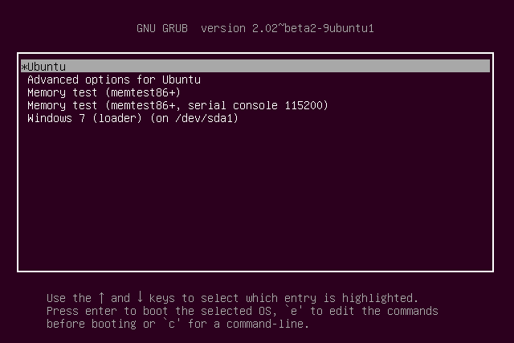

# Instalasi

### 1. Persiapan
- USB Flashdisk (minimal 4GB)
- Rufus (atau software lainnya untuk membuat perangkat USB Flashdisk menjadi bootable)
- ISO Ubuntu 16.04 LTS
- Installer VirtualBox

### 2. Teknik Instalasi
Jika hendak menggunakan lebih dari satu sistem operasi pada suatu komputer biasanya ada dua pilihan teknik instalasi, yaitu **dual-boot** atau **virtualisasi**.
**Dual-boot** adalah teknik menginstall dua atau lebih sistem operasi pada satu komputer, dimana masing-masing sistem operasi berjalan secara mandiri. Pengguna hanya dapat menggunakan salah satu dalam satu watu, dengan cara memilih sistem operasi yang akan dipakai ketika menyalakan komputer.

Gambar 1. Tampilan GRUB Dual Boot Linux(Ubuntu) dan Windows
(sumber : https://images.techhive.com/images/article/2015/07/boot-loader-100599648-orig.png)

Sedangkan **Virtualisasi** adalah teknik menginstal dan menjalankan suatu sistem operasi di atas sistem operasi lain sebagai host, yaitu dengan menggunakan program berjenis mesin virtual (virtual machine), salah satu contohnya adalah VirtualBox. Dengan mesin virtual ini, pengguna dapat menjalankan suatu sistem operasi, sebagai contoh Linux, pada saat sistem operasi lain berjalan, sebagai contoh Windows, sehingga pengguna dapat menjalankan beberapa sistem operasi sekaligus dalam satu waktu.

Berikut ini perbandingan dari kedua teknik instalasi tersebut:
