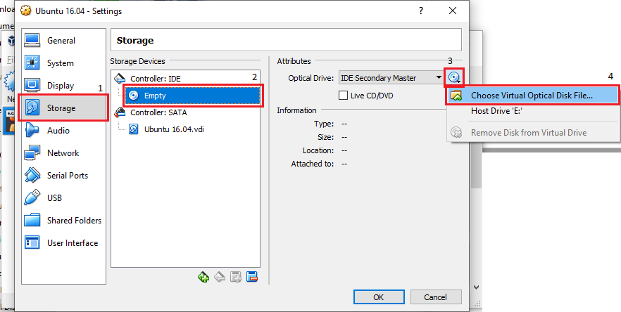

# Instalasi

### 1. Persiapan
- USB Flashdisk (minimal 4GB)
- Rufus (atau software lainnya untuk membuat perangkat USB Flashdisk menjadi bootable)
- ISO Ubuntu 16.04 LTS
- Installer VirtualBox

### 2. Teknik Instalasi
Jika hendak menggunakan lebih dari satu sistem operasi atau sering disebut OS(operating system) pada suatu komputer biasanya ada dua pilihan teknik instalasi, yaitu **dual-boot** atau **virtualisasi**.
**Dual-boot** adalah teknik menginstall dua atau lebih OS pada satu komputer, dimana masing-masing OS berjalan secara mandiri. Pengguna hanya dapat menggunakan salah satu OS dalam satu watu, dengan cara memilih OS yang akan dipakai ketika menyalakan komputer.

 dan Windows")

Sedangkan **Virtualisasi** adalah teknik menginstal dan menjalankan suatu OS di atas OS lain sebagai host, yaitu dengan menggunakan program berjenis mesin virtual (virtual machine), salah satu contohnya adalah VirtualBox. Dengan mesin virtual ini, pengguna dapat menjalankan suatu OS, sebagai contoh Linux, pada saat OS lain berjalan, sebagai contoh Windows, sehingga pengguna dapat menjalankan beberapa OS sekaligus dalam satu waktu.

Berikut ini perbandingan termasuk kelebihan dan kekurangan dari kedua teknik instalasi tersebut:

|Dual-Boot|Virtual Machine|
|---|---|
|Secara umum lebih cepat, karena masing - masing OS berjalan secara mandiri|Secara umum lebih lambat, karena harus berbagi sumber daya prosesor dan memori dengan OS host|
|Kedua OS dapat bertukar data dengan mudah, asalkan saling mendukung format sistem file pada harddisk|Bertukar file antar OS tidak dapat dilakukan secara langsung, perlu beberapa konfigurasi|
|Hanya dapat menjalankan salah satu OS saja pada satu waktu|Dapat menjalankan beberapa OS sekaligus dalam satu waktu(asal spesifikasi komputer mencukupi)|
|Prosedur instalasi dan konfigurasi untuk dual-booting cukup rumit dan beresiko (kehilangan data), terutama pada saat partisi harddisk|Prosedur instalasi OS menjadi mudah tanpa harus bingung dengan hal-hal teknis seperti partisi harddisk|
|Ideal untuk penggunaan sehari-hari, yang membutuhkan performa penuh komputer|Ideal untuk sekedar mengetes suatu OS, atau sekedar menjalankan suatu program yang tidak dapat berjalan pada OS host|
|Jika terjadi kerusakan pada salah satu OS, ada kemungkinan berpengaruh dengan OS satunya|Kerusakan pada OS yang di virtualisasikan tidak akan berpengaruh pada OS host|

#### 2.1 Langkah - Langkah Dual-Boot
1. **Menyiapkan Partisi Kosong untuk Ubuntu**
2. **Membuat Bootable USB Flashdisk Ubuntu**
3. **Melakukan Booting ke Bootable USB Flashdisk Ubuntu**
4. **Melakukan Instalasi Ubuntu + Membuat Partisi**
    1. satu
    2. dua
    3. tiga
    4. dll

#### 2.2 Langkah - Langkah Virtualisasi
1. Install Oracle VM VirtualBox. Jika sudah ada, lanjut ke langkah 2.
2. Buka aplikasi Oracle VM VirtualBox di Windows kamu.

3. Klik **New** untuk membuat Virtual Machine baru. Isi **name** dengan nama 'Ubunru 16.04', **type** pilih Linux, dan pilih **version** sesuai sepesifikasi PC atau Laptop kamu. Kemudian klik **Next** untuk proses selanjutnya.

4. Selanjutnya kamu disuruh untuk menentukan besaran memori, namun VirtualBox otomatis merekomendasikan besarnya memori. Jika sudah sesuai klik **Next**.

5. Selanjutnya kamu disuruh untuk menentukan ukuran harddisk, namun VirtualBox otomatis merekomendasikan ukuran harddisk. Jika sudah sesuai klik **Next**.

6. Klik **Next** saja pada proses ini untuk menuju proses selanjutnya.

7. Klik **Next** saja pada proses ini untuk menuju proses selanjutnya.
")
8. Menentukan ukuran harddisk(direkomendasikan minimal 10GB). Klik **Create**.
")
9. Yee, virtual machine yang kamu buat sudah jadi! Namun, kamu masih harus menginstall Ubuntu 16.04 pada virtual machine yang telah kamu buat.
10. Pilih virtual machine yang ingin di install, lalu klik **Setting** -> **Storage** -> **Controller: IDE** -> **Empty** -> **Choose Virtual Optical Disk File** untuk memilih file ISO Ubuntu yang akan di install. Kemudian klik **Start**(tanda panah hijau)

")
")
11. Yuhuu!! File ISO Ubuntu sudah berjalan. Selanjutnya tinggal ikuti langkah instalasinya.
