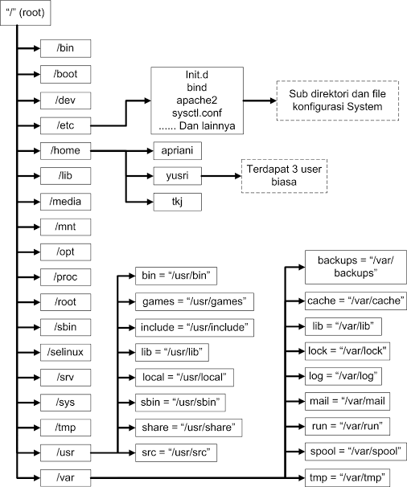

# Konsep
sub-materi
1. [Struktur Folder](#1-Struktur-Folder)
2. [Repository](#2-Repository)

## 1. Struktur Folder
Jika kita ingin belajar Linux lebih mendalam, hal yang paling dasar untuk dipahami adalah struktur direktorinya. Struktur direktori pada Linux sangat berbeda dengan Windows. Sistem operasi Windows memiliki struktur direktori yang sederhana dan mudah dipahami, seperti dibawah ini:  

- Program Files : Berfungsi untuk menyimpan program-program dan aplikasi  yang terinstal di dalam Windows
- Windows : menyimpan segala proses juga konten-konten utama windows. Akan terjadi kerudakan system jika ada kesalahan dalam mengatur folder ini. Isi dari folder ini berupa system32, Assembly, dan Web
- Temp : digunakan untuk menyimpan file-file sementara
- Document and Settings : berfungsi untuk menyimpan dokumen dan pengaturan-pengaturan user mulai dari desktop, start menu, dsb

Sedangkan pada struktur direktori pada Linux tidak akan ditemukan drive C, drive D, dan drive-drive lainnya karena Linux menganut satu direktori utama yaitu "/" (baca: root). Berikut ini adalah struktur direktori beserta apa yang berada di dalam sistem operasi Linux:

Penjelasan beberapa direktori yang perlu kalian ketahui: 
- / ("root") : Merupakan root atau akar dari seluruh direktori global. Partisi dimana diletakkan/ (root system) akan menjadi direktori sistem atau partisi pokok. Hanya bisa diakses oleh user root atau super user.
- /bin (user binaries) : Memuat program arahan yang merupakan sebagian dari sistem operasi Linux. Direktori ini meng-handle perintah standar Linux, seperti cd, ls, cp, dll.
- /boot (boot loader files) : Direktori yang berisi file-file yang berhubungan dengan boot loader, contohnya Grub boot manager, File Kernel initrd, vmlinux, dll.
- /dev (device file) : Memuat semua file penting.
## 2. Repository
### 2.1. Apa itu Repository?  
   **Repository** adalah tempat menyimpan berbagai macam program atau aplikasi yang telah di buat sedemikian rupa sehigga bisa di akses melalui internet. Selain di internet, **Repository** juga tersedia di media seperti DVD sebagai alternatif **Repository** saat tak ada koneksi internet. Ketika kita melakukan download Repository melalui internet default servernya adalah server luar, seperti archive.ubuntu.com, security.ubuntu.com, dll. Untuk Fungsinya, disini Repository berperan sebagai penyedia aplikasi atau kumpulan paket software dari distro-distro linux, yang dapat di akses melalui internet.  
  
### 2.2. Dimana file Repository itu berarda?  
File Repository ini langsung otomatis berada di laptop atau PC kita saat kita sudah menginstall linux dengan nama file biasanya "sources.list", terletak di folder apt di dalam folder etc. Jika ingin melihat Repository milik kita hanya perlu mengetikan :  
  

> sudo gedit /etc/apt/sources.list
  
Kita bisa melakukan edit seperti menambah, menghapus, mengganti Repostitory milik sobat sesuai yang sobat inginkan.  
  
### 2.3. Apakah Repository itu Penting?  
Adanya Repository di linux itu sangatlah _**Penting**_, karena itu adalah tempatnya paket-paket software untuk linux itu sendiri, kita hanya perlu langsung menginstall tanpa harus cari lagi paket softwarenya karena sudah tersedia di Repository tersebut. walau pun kita bisa juga mencar paket softwarenya secara manual dan menginstallnya juga, tetapi cara tersebut cukup ribet dan akan banyak memakan waktu. 
  
### 2.4. Apakah semua Paket software ada di Repostory? 
Tidak semua paket software langsung ada di repository, itu sebabnya kita harus tau nama file repository dan letaknya dimana, karena jika kita akan menginstall suatu software dan aplikasi, kemudian di Repository ternyata paketnya belum ada, kita bisa mencari repositorynya dan menambahkannya di di Repository kita dengan mengedit file sources.list tadi, yang berada di directory sudo gedit /etc/apt/sources.list.

