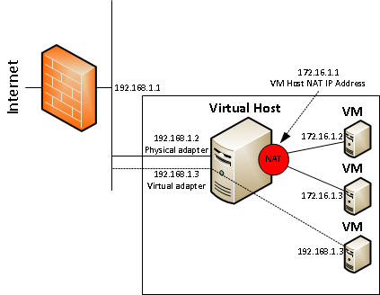
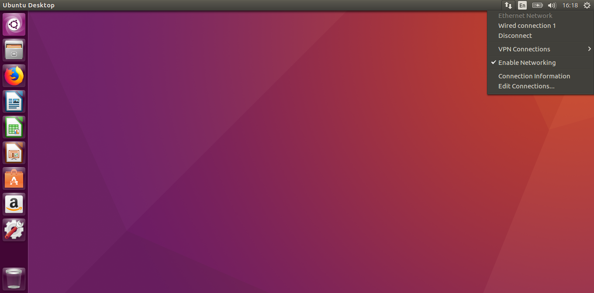
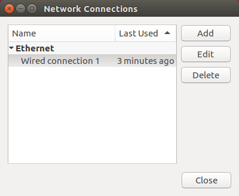
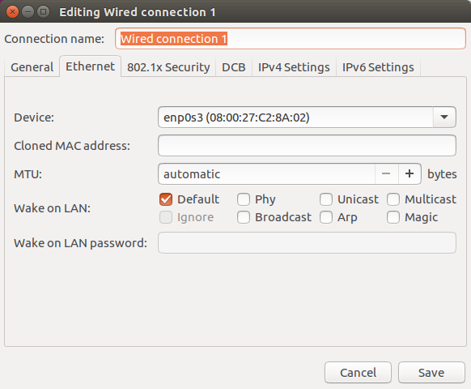
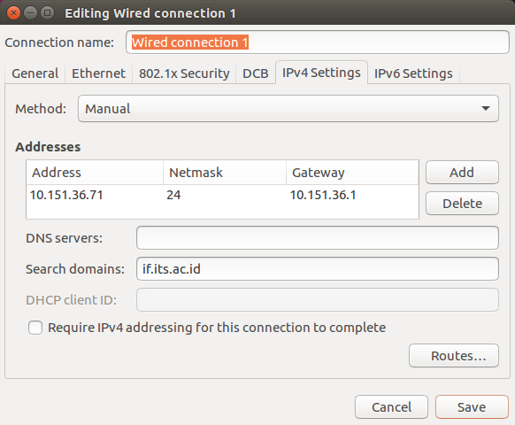

# Networking

sub-materi

1.  [VirtualBox Networking Modes](#1-VirtualBox-Networking-Modes)

2.  [Bridged Networking vs NAT](#2-Bridged-Networking-vs-NAT)

3.  [Setting IP Address Statis](#3-Setting-IP-Address-Statis)

  

### 1. VirtualBox Networking Modes

- Not attached

- Network Address Translation (NAT)

- NAT Network

- Bridged networking

- Internal networking

- Host-only networking

- Generic networking

  

### 2. Bridged Networking vs NAT

Dalam diagram ini, garis vertikal di sebelah firewall merepresentasikan jaringan produksi dan kita dapat melihat bahwa 192.168.1.1 adalah alamat IP firewall _organisasi_ yang menghubungkannya ke Internet. Ada juga virtual host dengan tiga mesin virtual yang berjalan di dalamnya. Lingkaran merah mewakili adaptor virtual yang menghubungkan mesin virtual NAT (172.16.1.1). Kita dapat melihat bahwa ada dua mesin virtual seperti itu dengan alamat IP 172.16.1.2 dan 172.16.1.3. Saat kita mengonfigurasi mesin virtual yang menggunakan NAT, ia tidak melihat jaringan _organisasi_ secara langsung. Bahkan, semua lalu lintas yang berasal dari mesin virtual akan menggunakan alamat IP host VM. Di belakang layar, lalu lintas dari mesin virtual diarahkan pada virtual host dan dikirim melalui adaptor fisik host dan, akhirnya, ke Internet.

  

Mesin virtual ketiga (192.168.1.3) dikonfigurasi dalam mode “**bridged**” yang pada dasarnya berarti bahwa adaptor jaringan virtual dalam mesin virtual tersebut dijembatani ke jaringan _organisasi_ dan mesin virtual itu beroperasi seolah-olah ada langsung di jaringan _organisasi_. Seperti mesin virtual berbasis NAT yang tidak dapat melihat jaringan _organisasi_, begitu juga sebalikya, mesin virtual dengan mode bridged network tidak dapat melihat dua mesin virtual berbasis NAT.

  

### 3. Setting IP Address Statis
1. klik ikon koneksi, lalu pilih 'edit'.

2. pilih 'wired connection 1' dan klik tombol 'edit'

3. pilih tab 'IPv4 Settings'

4. ubah metodenya menjadi manual, serta tambahkan alamat baru yang kita inginkan, serta atur DNS server serta search domain sesuai kebutuhan.

5. untuk mengaplikasikan perubahan silahkan lakukan koneksi ulang.

##### Referensi :
- https://www.virtualbox.org/manual/ch06.html#networkingmodes
- http://techgenix.com/nat-vs-bridged-network-a-simple-diagram-178/
- https://www.virtualbox.org/manual/ch06.html#networkingmodes
